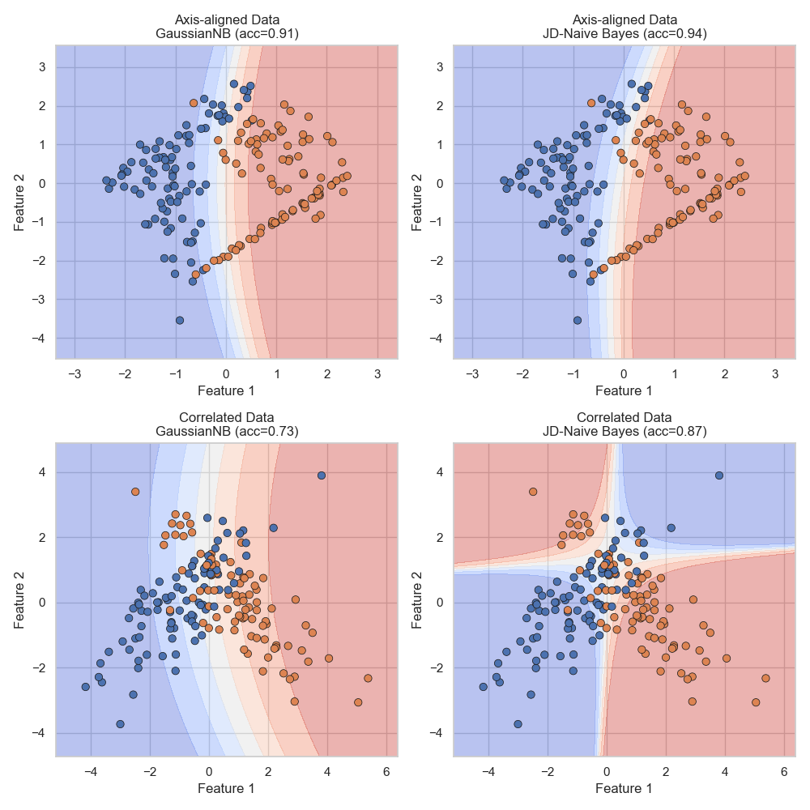

# Joint-Diagonalization Naive Bayes (JD-NB)

[](https://www.python.org/downloads/)
[](https://opensource.org/licenses/MIT)

This repository contains the Python implementation for the paper "A Unified Rotational Framework for Joint-Diagonalized Gaussian Naive Bayes".

The core idea is to enhance Gaussian Naive Bayes (GNB) by first learning an optimal rotation of the feature space. This rotation jointly diagonalizes the class covariance matrices, "de-correlating" the features and making the GNB's "naive" independence assumption hold true.


*(This image is generated by `run_exp1_synthetic.py` and saved to the `outputs/` folder)*

## The Problem: GNB's "Fatal Flaw"

Gaussian Naive Bayes is extremely fast and simple, but it relies on a "naive" assumption: that all features are independent of each other. This assumption is almost always false in real-world data.

* **Example**: In a dataset, a person's `height` and `weight` are clearly correlated.
* **The Failure**: GNB ignores this correlation, leading to incorrect probability estimates and poor decision boundaries. On our "Correlated Data" synthetic test, standard GNB achieves only **73.3%** accuracy.

## Our Solution: JD-NB

We "fix" the data for GNB. Our method learns a single, global, orthonormal rotation matrix `W` that transforms the data $Z = W^T X$.

This rotation `W` is optimized to make all class covariance matrices ($\Sigma_c$) as diagonal as possible, all at the same time. We do this by minimizing the total "Off-Diagonal Energy" across all classes:

$$ \mathcal{L}(W) = \sum_{c=1}^{K} \| \text{offdiag}(W^{T}\hat{\Sigma}_{c}W) \|_{F}^{2} $$

After finding the optimal `W`, we fit a standard GNB in this new, rotated `Z` space, where the features are now (mostly) independent.

## Key Results

This simple preprocessing step provides a dramatic boost in performance on correlated datasets, while "doing no harm" to data that is already independent.

| Dataset | GNB Accuracy | JD-NB Accuracy | Improvement |
| :--- | :---: | :---: | :---: |
| **Correlated Data (Synth)** | 0.7333 | **0.8667** | **+18.2%** |
| **Banknote (Real)** | 0.8665 | **0.9830** | **+13.4%** |
| Axis-aligned Data (Synth)| 0.9111 | **0.9389** | (No harm) |
| WineQuality (Real) | 0.7375 | **0.7500** | (Marginal gain) |

## Project Structure

```
/
├── jdnb/                 # The core Python library
│   ├── __init__.py       # Makes 'jdnb' a package
│   ├── model.py        # Contains the JDNB classifier class
│   ├── utils.py        # Helper functions (loss, stats, etc.)
│   └── datasets.py     # Data loaders (Synthetic, Wine, Banknote)
│
├── experiments/          # Runnable scripts to reproduce paper results
│   ├── plot_utils.py   # Helper for 2D decision boundaries
│   ├── run_exp1_synthetic.py  # Run 1: 2D Synthetic Data
│   └── run_exp2_real_world.py # Run 2: Full Wine & Banknote Data
│
├── outputs/              # Directory is created automatically
│   └── (All plots and images are saved here)
│
├── requirements.txt      # Project dependencies
└── README.md             # This file
```

## Installation

1.  Clone this repository to your local machine:
    ```sh
    git clone https://github.com/SuryaAnything/Joint-Diagonalization-Naive-Bayes
    cd YOUR_REPO_NAME
    ```

2.  Install the required Python packages:
    ```sh
    pip install -r requirements.txt
    ```

## How to Run Experiments

You can reproduce all results from the paper by running the experiment scripts from the root directory.

### Run 1: 2D Synthetic Datasets

This script runs the GNB vs. JD-NB comparison on the "Axis-aligned" and "Correlated" 2D datasets.

```sh
python experiments/run_exp1_synthetic.py
```

### Run 2: Real-World Datasets

This script runs the comparison on the full-dimensional (11D and 4D) Wine and Banknote datasets.

```sh
python experiments/run_exp2_real_world.py
```

## Expected Output

When you run the scripts:
1.  The model's training progress (`JD-Loss`) will be printed to the console.
2.  The final performance summary tables (like in the paper) will be printed to the console.
3.  All generated plots (decision boundaries, energy reduction charts) will be automatically saved as `.png` files in the `outputs/` directory.

## Citation

If you use this work, please cite the following (coming soon):
```
@article{Vachhani2024JDNB,
  title={A Unified Rotational Framework for Joint-Diagonalized Gaussian Naive Bayes},
  author={Rohan Vachhani, Miraj Rambhiya, Yasraj Badkul, Surya Narayan, Kirsh Kotak},
  year={2024},
  journal={arXiv preprint}
}
```